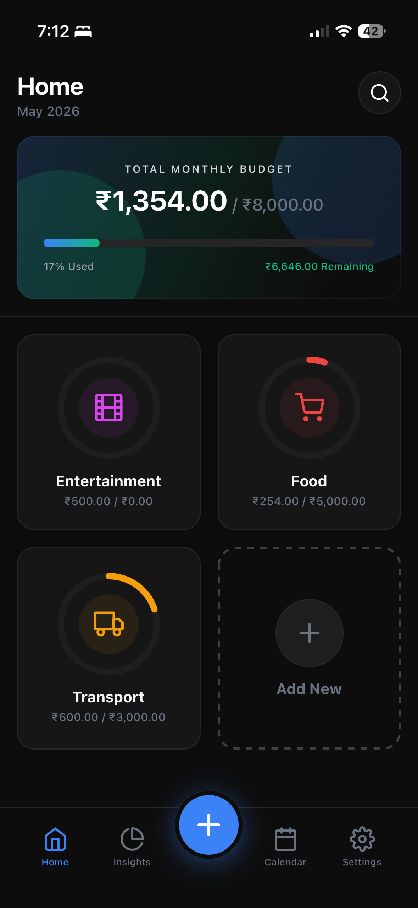
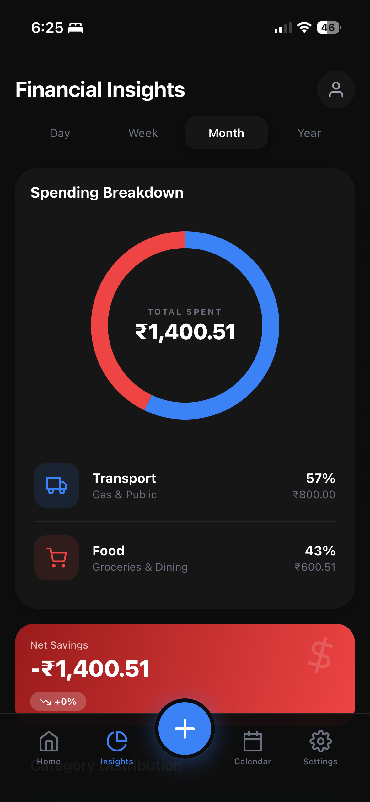
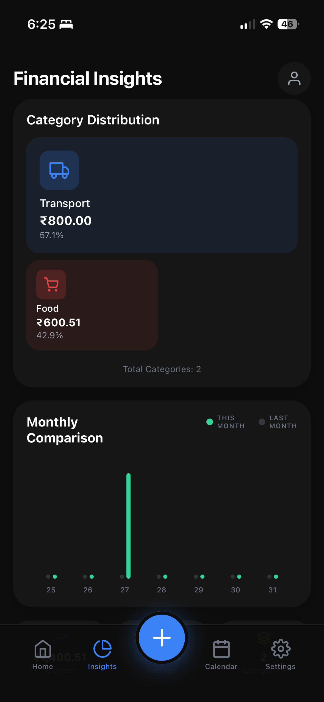
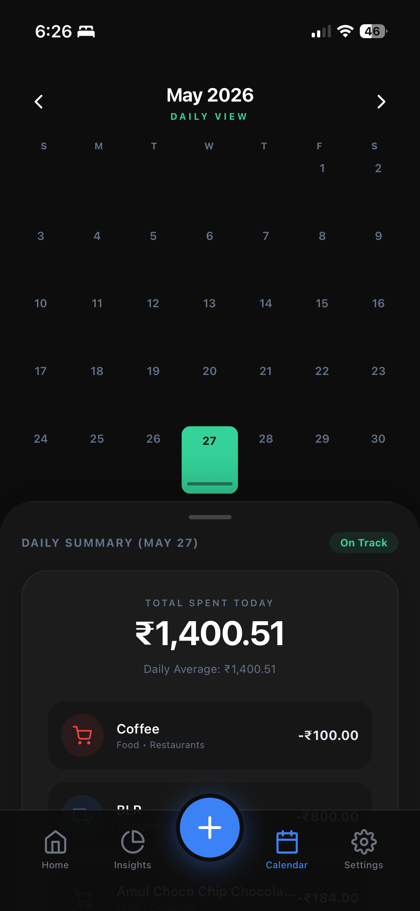
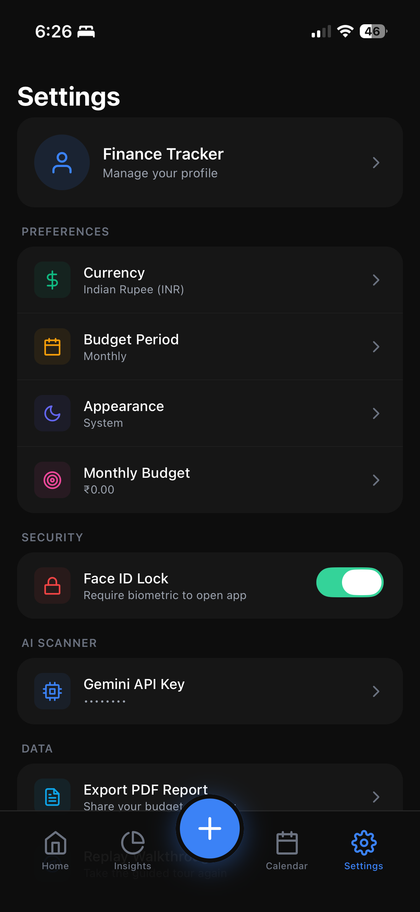

<


</div>

---

## 🎬 Demo

https://github.com/user-attachments/assets/Demo-Video.mp4

> *Full walkthrough of the app — from onboarding to budget tracking, AI receipt scanning, and insights.*

---

## 📱 Screenshots

<div align="center">
<table>
  <tr>
    <td align="center"><br /><b>Home Dashboard</b><br />Budget overview with category cards</td>
    <td align="center"><br /><b>Financial Insights</b><br />Spending breakdown & donut chart</td>
    <td align="center"><br /><b>Analytics Deep Dive</b><br />Category distribution & monthly comparison</td>
  </tr>
  <tr>
    <td align="center"><br /><b>Calendar View</b><br />Daily spending summary & transactions</td>
    <td align="center"><br /><b>Settings</b><br />Preferences, security & AI configuration</td>
    <td></td>
  </tr>
</table>
</div>

---

## ✨ Features

### 🏠 Smart Home Dashboard
- **Total Budget at a Glance** — Glassmorphic budget summary card with real-time progress
- **Category Cards** — Visual spending breakdown per category with circular progress indicators
- **Quick Add** — Floating action button to instantly log transactions
- **Search** — Find transactions quickly across all categories

### 📊 Financial Insights & Analytics
- **Multi-Timeframe Analysis** — Switch between Day, Week, Month, and Year views
- **Spending Breakdown** — Interactive donut chart showing total spend with category percentages
- **Category Distribution** — Visual treemap of spending by category
- **Monthly Comparison** — Bar chart comparing current vs. previous month spending
- **Net Savings Tracker** — Real-time savings calculation with trend indicators

### 📅 Calendar View
- **Visual Spending Calendar** — Color-coded daily spending heatmap
- **Daily Summary Panel** — Tap any day to see an "On Track" / "Over Budget" status
- **Transaction Details** — Per-day breakdown with category icons and amounts
- **Monthly Navigation** — Browse through months to track spending history

### 🤖 AI Receipt Scanner (Gemini API)
- **Receipt Photo Scanning** — Snap a photo of any receipt or invoice
- **Barcode Detection** — Integrated barcode scanner for quick product lookup
- **Auto Item Detection** — AI extracts line items, prices, and quantities
- **Smart Categorization** — Automatically suggests spending categories
- **Review & Edit** — Review scanned items before adding to your budget
- **Bring Your Own API Key** — Use your personal Gemini API key for AI features

### 🔄 Subscription Management
- **Track Recurring Expenses** — Manage Netflix, Spotify, gym memberships, and more
- **Billing Cycle Awareness** — Weekly, monthly, quarterly, and yearly billing periods
- **Monthly Cost Overview** — See total subscription costs at a glance

### 🎓 Guided Onboarding & Walkthrough
- **Animated Onboarding** — Beautiful Lottie-animated intro screens for first-time users
- **Step-by-Step Setup** — Guided currency selection, category creation, and biometric setup
- **In-App Walkthrough** — Interactive overlay walkthrough to learn every feature
- **Replay Anytime** — Re-trigger the walkthrough from Settings

### ⚙️ Settings & Customization
- **Profile Management** — Manage your profile and preferences
- **Multiple Currencies** — Support for USD, EUR, GBP, INR, JPY, and more
- **Budget Period** — Toggle between weekly and monthly budget periods
- **Appearance** — System, Light, and Dark theme options
- **Adjustable Budget** — Set and modify your total monthly budget
- **PDF Export** — Generate detailed spending reports and share them

### 🔒 Security & Privacy
- **Face ID / Touch ID Lock** — Biometric authentication to secure the app
- **Secure Storage** — Sensitive data (API keys, preferences) stored with Expo Secure Store
- **Local-First Architecture** — All financial data stored on-device with SQLite
- **No Cloud Dependency** — Your data never leaves your device

---

## 🛠️ Tech Stack

| Layer | Technology |
|---|---|
| **Framework** | React Native 0.81.5 + Expo SDK 54 |
| **Language** | TypeScript 5.9 |
| **Navigation** | Expo Router (File-based routing) |
| **State Management** | Zustand with persistence |
| **Database** | Expo SQLite |
| **AI / ML** | Google Gemini API (via Bring Your Own Key) |
| **Charts** | react-native-gifted-charts |
| **Animations** | React Native Reanimated + Lottie |
| **Forms** | React Hook Form |
| **UI Components** | Custom components + Expo Blur + Linear Gradient |
| **Icons** | @expo/vector-icons (Feather) |
| **Lists** | @shopify/flash-list |
| **Security** | expo-local-authentication + expo-secure-store |

---

## 🚀 Getting Started

### Prerequisites

| Requirement | Version |
|---|---|
| Node.js | 18+ |
| npm or yarn | Latest |
| Xcode | 15+ (for iOS development) |
| CocoaPods | Latest (`sudo gem install cocoapods`) |
| iOS Device / Simulator | iOS 16+ recommended |

### Installation

1. **Clone the repository**

   ```bash
   git clone https://github.com/yourusername/FinanceTracker.git
   cd FinanceTracker
   ```

2. **Install dependencies**

   ```bash
   npm install
   ```

3. **Install iOS pods**

   ```bash
   cd ios && pod install && cd ..
   ```

4. **(Optional) Set up Gemini API Key**

   Create a `.env` file in the project root:

   ```env
   GEMINI_API_KEY=your_api_key_here
   ```

   Or configure it in-app via **Settings → Gemini API Key**.

### Running the App

#### iOS Simulator

```bash
npx expo run:ios
```

#### Physical iPhone

1. **Connect your iPhone** via USB

2. **Find your device ID**

   ```bash
   xcrun xctrace list devices
   ```

3. **Run on device**

   ```bash
   npx expo run:ios --device YOUR_DEVICE_ID
   ```

   Or open via Xcode:

   ```bash
   open ios/FinanceTracker.xcworkspace
   ```

   Select your device and press **⌘R**

#### First Time on Physical Device

1. **Trust the Developer Certificate on iPhone:**
   - Navigate to **Settings → General → VPN & Device Management**
   - Tap on your developer profile → **Trust**

2. **Configure Signing in Xcode (if needed):**
   - Open `ios/FinanceTracker.xcworkspace`
   - Select the project → **Signing & Capabilities**
   - Enable **"Automatically manage signing"**
   - Select your Apple ID team

---

## 📁 Project Structure

```
FinanceTracker/
├── app/                        # Expo Router — file-based routing
│   ├── (onboarding)/           # Onboarding flow
│   │   ├── AnimatedOnboarding.tsx
│   │   ├── BiometricSetup.tsx
│   │   ├── CategorySetup.tsx
│   │   └── CurrencySetup.tsx
│   ├── (tabs)/                 # Main tab screens
│   │   ├── Home.tsx
│   │   ├── Analytics.tsx
│   │   ├── Calendar.tsx
│   │   ├── Subscriptions.tsx
│   │   └── Settings.tsx
│   ├── AddTransaction.tsx      # Transaction forms
│   ├── AddCategory.tsx
│   ├── AddSubcategory.tsx
│   ├── AddSubscription.tsx
│   ├── ReviewScannedItems.tsx  # AI scan review screen
│   ├── Category.tsx            # Category detail view
│   ├── Items.tsx               # Items list view
│   └── _layout.tsx             # Root layout
├── src/
│   ├── components/             # Reusable UI components
│   │   ├── BudgetSummaryCard.tsx
│   │   ├── CategoryCard.tsx
│   │   ├── CalendarDay.tsx
│   │   ├── CustomTabBar.tsx
│   │   ├── CircularProgress.tsx
│   │   ├── BarcodeScannerModal.tsx
│   │   ├── ScanningModal.tsx
│   │   ├── OnboardingSlide.tsx
│   │   ├── WalkthroughOverlay.tsx
│   │   ├── SwipeableTransaction.tsx
│   │   └── ...
│   ├── services/               # Business logic & API services
│   │   ├── receiptService.ts   # Gemini AI receipt scanning
│   │   └── barcodeService.ts   # Barcode detection & lookup
│   ├── database/               # SQLite database layer
│   │   ├── index.ts            # Database initialization & migrations
│   │   └── queries.ts          # CRUD operations
│   ├── hooks/                  # Custom React hooks
│   │   ├── useBiometricAuth.ts
│   │   ├── useCurrency.ts
│   │   ├── useHaptics.ts
│   │   └── useReceiptScanner.ts
│   ├── store/                  # Zustand state stores
│   │   ├── budgetStore.ts
│   │   ├── settingsStore.ts
│   │   ├── subscriptionStore.ts
│   │   ├── scanStore.ts
│   │   └── walkthroughStore.ts
│   ├── constants/              # App constants & defaults
│   ├── theme/                  # Colors, typography, spacing
│   ├── types/                  # TypeScript type definitions
│   └── utils/                  # Utility functions & helpers
├── assets/
│   ├── onboarding/             # Lottie animations for onboarding
│   ├── icon.png                # App icon
│   └── splash-icon.png         # Splash screen
└── ios/                        # Native iOS project
```

---

## 🗄️ Database Schema

The app uses **Expo SQLite** with the following schema:

| Table | Purpose |
|---|---|
| `categories` | Budget categories with limits, colors, and icons |
| `subcategories` | Nested subcategories within parent categories |
| `items` | Individual trackable items per subcategory |
| `transactions` | All spending records with amounts, dates, and notes |
| `subscriptions` | Recurring payment tracking with billing cycles |
| `settings` | User preferences and app configuration |
| `daily_spending_cache` | Cached daily spending totals for performance |
| `monthly_spending_cache` | Cached monthly spending totals for performance |

---

## 🔧 Configuration

### Currencies

Edit `src/constants/index.ts` to add more currencies:

```typescript
export const CURRENCIES = [
  { code: "USD", symbol: "$", name: "US Dollar" },
  { code: "EUR", symbol: "€", name: "Euro" },
  { code: "INR", symbol: "₹", name: "Indian Rupee" },
  // Add more currencies here
];
```

### Default Categories

Default categories are defined in `src/constants/index.ts`:

```typescript
export const DEFAULT_CATEGORIES = [
  { name: "Food & Dining", icon: "coffee", color: "#FF6B6B" },
  { name: "Transportation", icon: "truck", color: "#4ECDC4" },
  // Add more categories here
];
```

### Gemini API Key

The app supports **Bring Your Own API Key** for AI-powered receipt scanning. Configure it via:

- **In-app:** Settings → AI Scanner → Gemini API Key
- **Environment variable:** Add `GEMINI_API_KEY` to your `.env` file

---

## 🤝 Contributing

Contributions are welcome! Please follow the standard GitHub workflow:

1. Fork the repository
2. Create your feature branch (`git checkout -b feature/amazing-feature`)
3. Commit your changes (`git commit -m 'feat: add amazing feature'`)
4. Push to the branch (`git push origin feature/amazing-feature`)
5. Open a Pull Request

---

## 📄 License

This project is licensed under the **MIT License** — see the [LICENSE](LICENSE) file for details.

---

## 🙏 Acknowledgments

- [Expo](https://expo.dev/) — React Native development platform
- [React Navigation](https://reactnavigation.org/) — Navigation library
- [Zustand](https://zustand-demo.pmnd.rs/) — Lightweight state management
- [react-native-gifted-charts](https://github.com/Abhinandan-Kushwaha/react-native-gifted-charts) — Beautiful chart components
- [Google Gemini](https://ai.google.dev/) — AI-powered receipt scanning
- [LottieFiles](https://lottiefiles.com/) — Animation assets

---

<div align="center">

**Built with ❤️ by Ayush Srivastava**

React Native • Expo • TypeScript • Gemini AI

</div>
]]>
